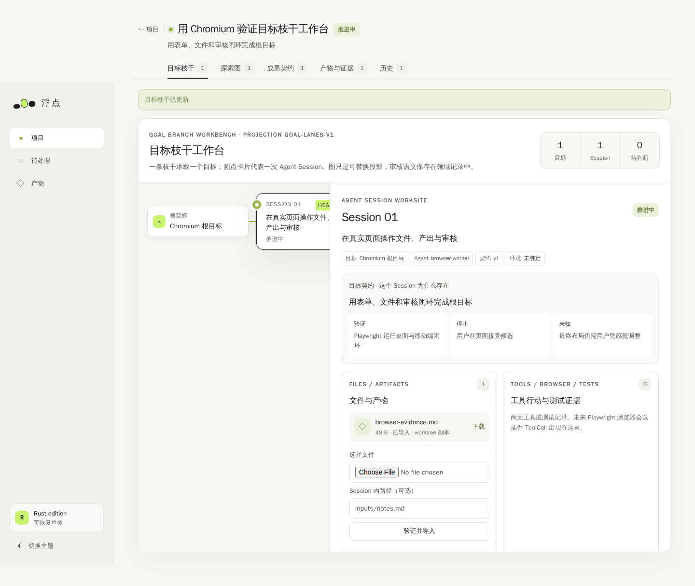
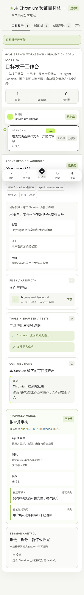

# 目标枝干工作台投影 v1

这是 [`product-design.md`](product-design.md) 中“像在管理者和员工的 VS Code 之间走动”的第一个可操作原型，不是最终 UI 结论。它保留旧 Fudian 的纸张底色、黑白主体、酸绿强调和紧凑工具感，并将新领域语义映射成 Git 图与工作区混合布局。

初版因大量 `6–10px` 文字被用户明确退回。当前截图属于同一目标枝干的 Session 02 可读性候选：所有有意义文字不低于 `12px`，正文不低于 `14px`，主要工作任务为 `16px`，同时提高了浅色/深色对比度。自动验证已通过，但仍等待用户实际阅读后的判断，不能据此宣称 UI 已完成。

## 投影与领域语义的边界

| 界面表达 | 权威领域对象 | 不变量 |
| --- | --- | --- |
| 横向枝干车道 | `GoalBranch` | 一条枝干只承载一个目标 |
| 车道中的圆点卡片 | `AgentSessionNode` | 一个 Session 是枝干上的主要工作节点 |
| `HEAD` | `GoalBranch.head_session_id` | 同枝干只有一个当前头 Session |
| 顶部待决定卡片 | `BranchProposal` | Proposal 不是 Session，批准后才创建枝干 |
| 右侧工作现场 | 选中 Session 的聚合视图 | 不制造第二套状态 |
| 拟合并审核卡 | `ReviewGate` + `ReviewDecision` | Agent 只能提交候选，用户最终决定 |

`src/web/goal_projection.rs` 将领域快照投影成 `goal-lanes-v1`。投影版本会写在 HTML `data-projection-version` 中，但不写回数据库。因此暂停、拟合并最终是圆点、标记还是独立节点，可以在后续根据使用感受更换，而不改变审计事实。旧探索 DAG 继续作为独立“探索图”页签可读写，不会被自动重解释为新目标枝干。

## Session 工作现场

点击 Session 后，右侧用按需披露展示：

- 当前契约的结果、验证、停止条件和未知；
- 文件/InputArtifact、inbox 副本或 Artifact 引用；
- 固定 EnvironmentManifest 指纹、ToolCall、未来的浏览器与测试证据；
- 本 Session 明确留下的 Contribution；
- 暂停原因、安全检查点、已尝试、风险、用户动作和 AI 建议；
- 候选快照、测试、风险、独立 AI 建议与用户决定。

主要表单不需要手写 JSON：可以创建/修订/批准 Proposal，记录 Contribution，拟定子目标，请求主观判断，异常或手动暂停，显式恢复，提出拟合并，记录独立 AI 审核，并由用户接受、部分接受或退回。关闭 JavaScript 时这些核心表单仍可用；分段文件选择器是渐进增强部分。

## 响应式取舍

桌面端将枝干图和 Session 现场并排，图区和现场区各自滚动，接近 Git 图 + VS Code 工作区。宽度不足 900px 时改为上下结构；390px 手机上枝干与 Session 改成垂直时间线，完整现场仍可审核和操作，页面级没有横向溢出。

## 可重复验收

- `scripts/test-workbench-http.sh` 在一次性 PostgreSQL 与预览中用结构化 HTML 表单跑通 Proposal → 判断暂停/恢复 → Contribution → 拟合并 → AI 建议 → 用户接受。
- `scripts/test-workbench-browser.sh` 使用固定的官方 `mcr.microsoft.com/playwright:v1.62.0-noble` 容器和匹配测试包，用 Chromium 真实点击全流程、上传文件、检查 1440px/390px 溢出并生成上述截图。

这些截图只是当前可用基线，不代表已经替用户决定最终布局、信息密度或交互手感。
